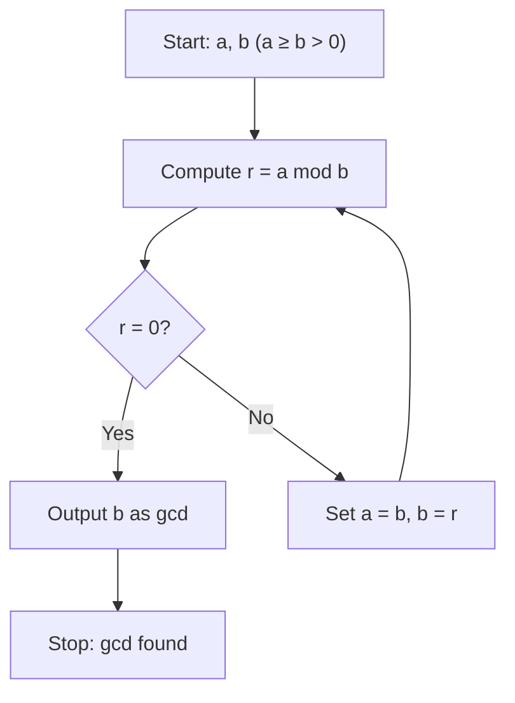

# undergraduate mathematics depa...

 Foundations of Number Theory

Number theory, often described as the "Queen of Mathematics," begins its majestic reign with the simplest of all mathematical objects: the integers. This foundational chapter establishes the bedrock upon which all subsequent number-theoretic structures are built. We explore the basic properties of integers, the concepts of divisibility, the theory of greatest common divisors including the powerful Euclidean Algorithm, the fundamental nature of prime numbers, and we conclude with a gentle introduction to modular arithmetic—a system of arithmetic for integers where numbers "wrap around" upon reaching a certain value.

---

## 1.1 The Integers and Divisibility
At the heart of number theory lies the set of integers, denoted by $\mathbb{Z}$:
$$ \mathbb{Z} = \{\ldots, -3, -2, -1, 0, 1, 2, 3, \ldots\} $$
We begin with a property so fundamental that it is often taken for granted, yet it underpins many proofs: the Well-Ordering Principle.

### The Well-Ordering Principle
> **Well-Ordering Principle.** Every nonempty set of positive integers contains a least element.

While this statement seems intuitively obvious, its consequences are profound. It is equivalent to the Principle of Mathematical Induction and is often used to establish the existence of minimal counterexamples in proofs.

**Example:** Consider the set $S = \{4, 7, 10, 13, \ldots\}$, the set of all positive integers congruent to $1 \pmod{3}$. The least element is $4$.

A crucial application is the proof of the Division Algorithm, which we will demonstrate shortly. First, we formalize the notion of divisibility.

### Divisibility and the Division Algorithm
> **Definition: Divisibility.** Let $a, b \in \mathbb{Z}$ with $b \neq 0$. We say $b$ **divides** $a$, written $b \mid a$, if there exists an integer $c$ such that $a = bc$. If $b$ does not divide $a$, we write $b \nmid a$.

If $b \mid a$, we also say that $b$ is a **divisor** (or **factor**) of $a$, and $a$ is a **multiple** of $b$.

**Basic Properties:**
1. If $a \mid b$ and $b \mid c$, then $a \mid c$ (transitivity).
2. If $a \mid b$ and $a \mid c$, then $a \mid (bx + cy)$ for any integers $x, y$ (linearity).
3. If $a \mid b$ and $b \neq 0$, then $|a| \le |b|$.
4. If $a \mid b$ and $b \mid a$, then $a = \pm b$.

**Example:** $5 \mid 35$ because $35 = 5 \cdot 7$, but $6 \nmid 35$ because there is no integer $c$ with $35 = 6c$.

The Division Algorithm is not an algorithm in the computational sense but a theorem guaranteeing the existence and uniqueness of a quotient and remainder when one integer is divided by another.

> **Theorem 1.1 (The Division Algorithm).** For any integers $a$ and $b$ with $b > 0$, there exist unique integers $q$ (the quotient) and $r$ (the remainder) such that
> $$ a = bq + r, \qquad 0 \le r < b. $$

*Proof.* We prove existence using the Well-Ordering Principle. Consider the set
$$ S = \{a - bk \mid k \in \mathbb{Z}, \; a - bk \ge 0\}. $$
$S$ is nonempty because we can choose $k$ sufficiently negative so that $a - bk > 0$. By the Well-Ordering Principle, $S$ has a least element; call it $r = a - bq$ for some integer $q$. By definition, $r \ge 0$. We must show $r < b$. Suppose, for contradiction, $r \ge b$. Then $r - b = a - b(q+1) \ge 0$, so $r - b \in S$. But $r - b < r$, contradicting the minimality of $r$. Hence $0 \le r < b$.

For uniqueness, assume $a = bq_1 + r_1 = bq_2 + r_2$ with $0 \le r_1, r_2 < b$. Then $b(q_1 - q_2) = r_2 - r_1$. The left side is a multiple of $b$, while the right side satisfies $-b < r_2 - r_1 < b$. The only multiple of $b$ strictly between $-b$ and $b$ is $0$. Thus $r_2 - r_1 = 0$, so $r_1 = r_2$ and $q_1 = q_2$.

The division algorithm extends to the case where the divisor $b$ is negative by replacing $b$ with $|b|$ and adjusting the sign of $q$ accordingly. The remainder $r$ must satisfy $0 \le r < |b|$.

**Example:** For $a = 47$ and $b = 6$, $47 = 6 \cdot 7 + 5$, so $q = 7$, $r = 5$. For $a = -47$ and $b = 6$, $-47 = 6 \cdot (-8) + 1$, because $-47 - 6(-8) = 1$ and $0 \le 1 < 6$.

---

## 1.2 Greatest Common Divisor and the Euclidean Algorithm
When dealing with divisibility, the concept of a common divisor naturally arises. The greatest common divisor is a cornerstone of number theory.

### Definition and Basic Properties
> **Definition: Greatest Common Divisor (GCD).** Let $a, b \in \mathbb{Z}$, not both zero. The **greatest common divisor** of $a$ and $b$, denoted $\gcd(a, b)$, is the largest positive integer $d$ such that $d \mid a$ and $d \mid b$.

If $\gcd(a, b) = 1$, we say $a$ and $b$ are **relatively prime** (or **coprime**).

**Basic Properties:**
- $\gcd(a, b) = \gcd(|a|, |b|)$.
- $\gcd(a, 0) = |a|$ for $a \neq 0$.
- $\gcd(a, b) = \gcd(a - bq, b)$ for any integer $q$.
- $\gcd(ka, kb) = |k|\gcd(a, b)$.
- If $d = \gcd(a, b)$, then $\gcd(a/d, b/d) = 1$.

The GCD can be computed by listing divisors, but for large numbers, the Euclidean Algorithm provides an efficient method.

### The Euclidean Algorithm
The Euclidean Algorithm is based on repeated application of the division algorithm and the key property: $\gcd(a, b) = \gcd(b, r)$, where $r$ is the remainder when $a$ is divided by $b$.

> **Euclidean Algorithm:** Given integers $a, b$ with $a \ge b > 0$, set $r_0 = a$, $r_1 = b$. Then perform:
> $$ \begin{aligned}
r_0 &= q_1 r_1 + r_2, \quad 0 < r_2 < r_1 \\
r_1 &= q_2 r_2 + r_3, \quad 0 < r_3 < r_2 \\
&\;\;\vdots \\
r_{n-2} &= q_{n-1} r_{n-1} + r_n, \quad 0 < r_n < r_{n-1} \\
r_{n-1} &= q_n r_n + 0.
\end{aligned} $$
> The process stops when a remainder of $0$ is reached. The last nonzero remainder, $r_n$, is $\gcd(a, b)$.

This works because the remainders form a strictly decreasing sequence of nonnegative integers, which must eventually reach zero.



**Example:** Find $\gcd(252, 105)$.
$$ \begin{aligned}
252 &= 2 \cdot 105 + 42 \\
105 &= 2 \cdot 42 + 21 \\
42 &= 2 \cdot 21 + 0.
\end{aligned} $$
The last nonzero remainder is $21$, so $\gcd(252, 105) = 21$.

The algorithm is extremely efficient even for numbers with hundreds of digits, making it a fundamental tool in computational number theory and cryptography.

### Bezout's Identity and Linear Combinations
One of the most profound consequences of the Euclidean Algorithm is that the GCD can be expressed as an integer linear combination of the two numbers.

> **Theorem 1.2 (Bezout's Identity).** For any integers $a, b$ (not both zero), there exist integers $x, y$ such that
> $$ \gcd(a, b) = ax + by. $$
> Moreover, $\gcd(a, b)$ is the smallest positive integer that can be written in this form.

*Proof.* (Sketch) The set $S = \{ax + by \mid x, y \in \mathbb{Z}, \; ax + by > 0\}$ is nonempty. Let $d$ be its least element; then $d = ax_0 + by_0$. One shows that $d$ divides both $a$ and $b$, and that any common divisor of $a$ and $b$ divides $d$. Hence $d = \gcd(a, b)$.

The coefficients $x, y$ can be found by back-substitution in the Euclidean Algorithm steps. This process is often called the **extended Euclidean Algorithm**.

**Example:** From the previous example, $\gcd(252, 105) = 21$. Working backwards:
$$ \begin{aligned}
21 &= 105 - 2 \cdot 42 \\
42 &= 252 - 2 \cdot 105
\end{aligned} $$
Substituting, $21 = 105 - 2(252 - 2 \cdot 105) = -2 \cdot 252 + 5 \cdot 105$. Thus $x = -2$, $y = 5$.

Bezout's Identity has immediate important corollaries:
- **Euclid's Lemma:** If $a \mid bc$ and $\gcd(a, b) = 1$, then $a \mid c$.
- If $c \mid a$ and $c \mid b$, then $c \mid \gcd(a, b)$.
- The integers $a$ and $b$ are coprime iff there exist $x, y$ with $ax + by = 1$.

---

## 1.3 Prime Numbers
Primes are the atoms of the integer universe. Understanding their properties is central to number theory.

### Definition and Basic Properties
> **Definition: Prime and Composite.** A positive integer $p > 1$ is called **prime** if its only positive divisors are $1$ and $p$. A positive integer greater than $1$ that is not prime is called **composite**. The number $1$ is neither prime nor composite; it is a unit.

The first few primes are $2, 3, 5, 7, 11, 13, \ldots$. The number $2$ is the only even prime.

> **Lemma 1.3.** Every integer $n > 1$ has a prime divisor.

*Proof.* By contradiction: assume $n$ is the smallest integer $>1$ with no prime divisor. Since $n$ is composite, $n = ab$ with $1 < a, b < n$. By minimality, $a$ has a prime divisor $p$, which then divides $n$, a contradiction.

A fundamental divisibility property specific to primes is:
> **Theorem 1.4.** If $p$ is prime and $p \mid ab$, then $p \mid a$ or $p \mid b$.

*Proof.* If $p \nmid a$, then $\gcd(p, a) = 1$. By Bezout's Identity, $1 = px + ay$. Multiply by $b$: $b = pbx + aby$. Since $p \mid p b x$ and $p \mid a b y$, $p \mid b$.

By induction, this extends to any number of factors.

### The Fundamental Theorem of Arithmetic
The Fundamental Theorem states that every integer greater than $1$ can be expressed uniquely as a product of primes, up to order.

> **Theorem 1.5 (Fundamental Theorem of Arithmetic).** Every integer $n > 1$ can be written as a product of primes,
> $$ n = p_1^{e_1} p_2^{e_2} \cdots p_k^{e_k}, $$
> where $p_1 < p_2 < \cdots < p_k$ are primes and $e_i \ge 1$. This representation is unique.

*Proof.* (Existence) by strong induction. Base case: $n=2$ is prime. Assume true for all integers $< n$. If $n$ is prime, done. Else $n = ab$, $1 < a, b < n$. By induction, $a$ and $b$ factor into primes, so $n$ does.

(Uniqueness) Suppose $n = p_1 p_2 \cdots p_r = q_1 q_2 \cdots q_s$ where all $p_i, q_j$ are primes (not necessarily distinct). Then $p_1 \mid q_1 q_2 \cdots q_s$. By repeated application of Theorem 1.4, $p_1$ must divide some $q_j$, so $p_1 = q_j$ because both are prime. Cancel $p_1$ from both sides and repeat. Thus the lists are identical up to order; exponents follow.

**Example:** $84 = 2^2 \cdot 3 \cdot 7$. The canonical factorization is unique.

This theorem is so ingrained that we often write $n = \prod_{p} p^{e_p}$ where $e_p \ge 0$ for all primes $p$, with only finitely many nonzero exponents.

### Infinitude of Primes
One of the most celebrated proofs in mathematics is Euclid's demonstration that there are infinitely many primes.

> **Theorem 1.6 (Euclid).** There are infinitely many prime numbers.

*Proof.* Suppose, for contradiction, that there are only finitely many primes, say $p_1, p_2, \ldots, p_k$. Consider the integer
$$ N = p_1 p_2 \cdots p_k + 1. $$
By Lemma 1.3, $N$ has a prime divisor $p$. That $p$ must be one of the $p_i$? If $p = p_i$ for some $i$, then $p \mid p_1 p_2 \cdots p_k$, so $p \mid (N - p_1 p_2 \cdots p_k) = 1$, which is impossible. Thus $p$ is a new prime not in the list, a contradiction.

This elegant proof shows that no finite set can encompass all primes. The distribution of primes remains a deep area of study, culminating in the Prime Number Theorem (to be explored in a later chapter).

---

## 1.4 Modular Arithmetic: An Introduction
Modular arithmetic, often called "clock arithmetic," is a system where numbers are considered equivalent if they have the same remainder upon division by a fixed modulus. This concept pervades modern cryptography, computer science, and many areas of number theory.

> **Definition: Congruence Modulo n.** Let $n$ be a positive integer. For integers $a, b$, we say $a$ is **congruent to** $b$ **modulo** $n$, written
> $$ a \equiv b \pmod{n}, $$
> if $n \mid (a - b)$.

In other words, $a$ and $b$ have the same remainder when divided by $n$.

**Example:** $17 \equiv 5 \pmod{4}$ because $4 \mid (17-5)=12$. Also $ -3 \equiv 1 \pmod{4}$ because $-3 - 1 = -4$ is divisible by $4$.

> **Theorem 1.7 (Basic Properties).** Congruence modulo $n$ is an equivalence relation:
> 1. **Reflexivity:** $a \equiv a \pmod{n}$.
> 2. **Symmetry:** If $a \equiv b \pmod{n}$, then $b \equiv a \pmod{n}$.
> 3. **Transitivity:** If $a \equiv b \pmod{n}$ and $b \equiv c \pmod{n}$, then $a \equiv c \pmod{n}$.

Moreover, congruence is compatible with addition, subtraction, and multiplication:
> If $a \equiv b \pmod{n}$ and $c \equiv d \pmod{n}$, then
> - $a + c \equiv b + d \pmod{n}$,
> - $a - c \equiv b - d \pmod{n}$,
> - $ac \equiv bd \pmod{n}$.

These properties allow us to perform arithmetic modulo $n$ almost as we do with ordinary integers, but with the caveat that cancellation for multiplication requires care (if $\gcd(k, n) = 1$, then $ka \equiv kb \pmod{n}$ implies $a \equiv b \pmod{n}$).

**The Ring $\mathbb{Z}/n\mathbb{Z}$.** The set of all equivalence classes modulo $n$, denoted $\mathbb{Z}/n\mathbb{Z}$ or $\mathbb{Z}_n$, forms a commutative ring with $n$ elements:
$$ \mathbb{Z}/n\mathbb{Z} = \{\overline{0}, \overline{1}, \overline{2}, \ldots, \overline{n-1}\} $$
where $\overline{a} = \{a + kn \mid k \in \mathbb{Z}\}$.

Addition and multiplication are defined by $\overline{a} + \overline{b} = \overline{a+b}$ and $\overline{a} \cdot \overline{b} = \overline{ab}$. These operations are well-defined precisely because of the congruence properties.

**Example (Modulo 6):** In $\mathbb{Z}/6\mathbb{Z}$,
$$ \overline{4} + \overline{5} = \overline{9} = \overline{3}, \qquad \overline{2} \cdot \overline{3} = \overline{6} = \overline{0}. $$
Notice that $\overline{2} \cdot \overline{3} = \overline{0}$ but neither $\overline{2}$ nor $\overline{3}$ is zero. This shows that $\mathbb{Z}/n\mathbb{Z}$ can have zero divisors when $n$ is composite. When $n$ is prime, $\mathbb{Z}/p\mathbb{Z}$ is a field.

**Solving Linear Congruences.** A simple linear congruence $ax \equiv b \pmod{n}$ can be solved using the Euclidean Algorithm. It has a solution iff $\gcd(a, n) \mid b$, and the number of solutions modulo $n$ is $\gcd(a, n)$. The tools developed in this chapter—Bezout's Identity and the Euclidean Algorithm—are exactly what we need.

**Example:** Solve $6x \equiv 4 \pmod{10}$.
We compute $d = \gcd(6, 10) = 2$. Since $2 \mid 4$, there are $2$ solutions modulo $10$. Reduce: divide by $2$ to get $3x \equiv 2 \pmod{5}$. Using Bezout, $3 \cdot 2 = 6 \equiv 1 \pmod{5}$, so $x \equiv 2 \cdot 2 = 4 \pmod{5}$. The two solutions modulo $10$ are $x \equiv 4$ and $x \equiv 9$ (adding $5$ to the base solution).

Modular arithmetic provides the language for deeper studies: Fermat's Little Theorem, Euler's theorem, quadratic residues, and the Chinese Remainder Theorem, which we will explore in Chapter 2.

---

**Chapter Summary.** We have established the foundational vocabulary and tools:
- The integers and their ordering properties.
- Divisibility and the division algorithm.
- The greatest common divisor, computed efficiently via the Euclidean Algorithm, and its representation as a linear combination.
- The fundamental nature and infinitude of primes.
- The basics of modular arithmetic, a powerful shorthand for remainder-based reasoning.

These concepts form the indispensable scaffolding for all advanced number theory. With this foundation securely laid, we are ready to delve into the rich theory of congruences.


---

**Knowledge Check**

> **Question 1.**  
> For \(a = -47\) and \(b = 6\), what are the unique quotient \(q\) and remainder \(r\) guaranteed by the Division Algorithm, i.e., \(a = bq + r\) with \(0 \le r < b\)?  
> A) \(q = -7\), \(r = 5\)  
> B) \(q = -8\), \(r = 1\)  
> C) \(q = -7\), \(r = -5\)  
> D) \(q = -8\), \(r = -1\)

> **Question 2.**  
> Use the Euclidean Algorithm to compute \(\gcd(252, 105)\). Then express the gcd as an integer linear combination \(252x + 105y = \gcd(252, 105)\). Show the back‑substitution steps or the extended algorithm result.

> **Question 3.**  
> In Euclid’s famous proof of the infinitude of primes, one supposes that \(p_1, p_2, \dots, p_k\) are **all** the primes and constructs \(N = p_1 p_2 \cdots p_k + 1\). Why does this lead to a contradiction?  
> A) \(N\) must itself be prime, but it is larger than any \(p_i\).  
> B) \(N\) has a prime divisor that cannot be equal to any of the \(p_i\).  
> C) \(N\) is odd, so it must be divisible by 2.  
> D) \(N\) can be factored as a product of the primes \(p_1, \dots, p_k\) with a remainder of 1.

---

<details>
<summary><strong>Answers</strong> (click to expand)</summary>

**Answer 1:** **B** – Using the Division Algorithm, \(-47 = 6 \cdot (-8) + 1\), so \(q = -8\) and \(r = 1\) (since \(0 \le 1 < 6\)).

**Answer 2:**  
Euclidean Algorithm:  
\[
\begin{aligned}
252 &= 2 \cdot 105 + 42 \\
105 &= 2 \cdot 42 + 21 \\
42 &= 2 \cdot 21 + 0
\end{aligned}
\]
The last nonzero remainder is \(21\), so \(\gcd(252, 105) = 21\).  
Back‑substitution to find \(x, y\):  
\[
\begin{aligned}
21 &= 105 - 2 \cdot 42 \\
42 &= 252 - 2 \cdot 105 \\
\Rightarrow 21 &= 105 - 2(252 - 2 \cdot 105) = -2 \cdot 252 + 5 \cdot 105.
\end{aligned}
\]
Thus \(x = -2\), \(y = 5\) (or any integer combination \((-2 + 5t) \cdot 252 + (5 - 12t) \cdot 105 = 21\)).

**Answer 3:** **B** – By Lemma 1.3, \(N\) has some prime divisor \(p\). If \(p\) were one of the \(p_i\), then \(p\) would divide both \(p_1p_2\cdots p_k\) and \(N\), hence would divide their difference \(1\), which is impossible. Therefore \(p\) is a new prime not in the original list, contradicting the assumption that \(p_1,\dots,p_k\) were all the primes.

</details>

 Congruences

 Arithmetic Functions

 Quadratic Residues and Quadratic Reciprocity

The study of quadratic residues—those integers that are perfect squares modulo a prime—reveals a beautiful and profound symmetry in number theory. This chapter develops the theory of quadratic residues, introduces the Legendre symbol as a powerful notation, and culminates in the celebrated Law of Quadratic Reciprocity, a cornerstone of algebraic number theory that relates the solvability of $x^2 \equiv p \pmod{q}$ to that of $x^2 \equiv q \pmod{p}$ for odd primes $p$ and $q$. We then extend the Legendre symbol to the Jacobi symbol, which greatly simplifies computations, and explore practical applications in solving quadratic congruences.

---

## 4.1 Quadratic Residues

Before attempting to solve quadratic congruences, we must determine when they have solutions. The notions of quadratic residues and non‑residues capture exactly this.

### 4.1.1 Definition and the Legendre Symbol

> **Definition 4.1 (Quadratic Residue).** Let $p$ be an odd prime and $a$ an integer with $\gcd(a,p)=1$. We say $a$ is a **quadratic residue modulo $p$** if the congruence
> $$x^2 \equiv a \pmod p$$
> has a solution. If no solution exists, $a$ is called a **quadratic non‑residue modulo $p$**.

**Example:** For $p=7$, the squares of $1,2,3,4,5,6$ modulo $7$ are $1,4,2,2,4,1$. Thus the quadratic residues modulo $7$ are $1,2,4$; the non‑residues are $3,5,6$.

Counting shows that among the $p-1$ nonzero residues, exactly half are quadratic residues and half are non‑residues. This follows because the mapping $x \mapsto x^2 \bmod p$ is a homomorphism from $(\mathbb{Z}/p\mathbb{Z})^\times$ onto its subgroup of squares, whose kernel $\{\pm1\}$ has size $2$.

The **Legendre symbol**, introduced by Adrien‑Marie Legendre, gives a compact algebraic notation.

> **Definition 4.2 (Legendre Symbol).** For an odd prime $p$ and integer $a$,
> $$\left(\frac{a}{p}\right) = \begin{cases}
> 1 & \text{if $a$ is a quadratic residue modulo $p$ and $p \nmid a$},\\
> -1& \text{if $a$ is a quadratic non‑residue modulo $p$},\\
> 0 & \text{if $p \mid a$}.
> \end{cases}$$

The Legendre symbol enjoys the following fundamental properties.

**Properties:**
1. **(Multiplicativity)** $\displaystyle\left(\frac{ab}{p}\right) = \left(\frac{a}{p}\right)\left(\frac{b}{p}\right)$ for all integers $a,b$.
2. **(Euler’s criterion)** If $p \nmid a$, $\displaystyle a^{(p-1)/2} \equiv \left(\frac{a}{p}\right) \pmod p$.
3. **(Value at $-1$)** $\displaystyle\left(\frac{-1}{p}\right) = (-1)^{(p-1)/2}$; i.e., $-1$ is a quadratic residue iff $p \equiv 1 \pmod 4$.
4. **(Value at $2$)** $\displaystyle\left(\frac{2}{p}\right) = (-1)^{(p^2-1)/8}$; i.e., $2$ is a quadratic residue iff $p \equiv \pm1 \pmod 8$.

Property (1) makes the Legendre symbol a **homomorphism** from $(\mathbb{Z}/p\mathbb{Z})^\times$ to $\{\pm1\}$. Property (2) is Euler’s criterion, which we prove next.

### 4.1.2 Euler’s Criterion

> **Theorem 4.3 (Euler’s Criterion).** Let $p$ be an odd prime and $a$ an integer with $\gcd(a,p)=1$. Then
> $$a^{(p-1)/2} \equiv \left(\frac{a}{p}\right) \pmod p.$$

*Proof.* Since $(\mathbb{Z}/p\mathbb{Z})^\times$ is cyclic of order $p-1$, we can pick a primitive root $g$. Write $a \equiv g^k \pmod p$ with $0 \le k \le p-2$. Then
$$a^{(p-1)/2} \equiv g^{k(p-1)/2} \equiv (g^{(p-1)})^{k/2} \equiv 1^{k/2} \pmod p$$
if $k$ is even, and if $k$ is odd,
$$a^{(p-1)/2} \equiv g^{k(p-1)/2} \equiv (g^{(p-1)/2})^{k}.$$
But $g^{(p-1)/2} \equiv -1 \pmod p$ because $g$ is a primitive root (its order is $p-1$). Hence $a^{(p-1)/2} \equiv (-1)^k \pmod p$.  

Now $a$ is a quadratic residue exactly when $k$ is even, because then $a \equiv (g^{k/2})^2$. Thus $\left(\frac{a}{p}\right) = 1$ iff $k$ is even, and $-1$ iff $k$ is odd. So $a^{(p-1)/2} \equiv (-1)^k \equiv \left(\frac{a}{p}\right) \pmod p$. ∎

Euler’s criterion immediately yields the multiplicativity of the Legendre symbol as well as the formulas for $\left(\frac{-1}{p}\right)$ and $\left(\frac{2}{p}\right)$ by direct evaluation. It also provides a method to compute the symbol—though for large $a$, the exponentiation is costly; we will discover a much faster way via quadratic reciprocity.

### 4.1.3 The Law of Quadratic Reciprocity

The Legendre symbol’s true power is unleashed by the remarkable reciprocity law that connects $\left(\frac{p}{q}\right)$ and $\left(\frac{q}{p}\right)$ for distinct odd primes $p$ and $q$.

> **Theorem 4.4 (Law of Quadratic Reciprocity).** For distinct odd primes $p$ and $q$,
> $$\left(\frac{p}{q}\right)\left(\frac{q}{p}\right) = (-1)^{\frac{p-1}{2}\cdot\frac{q-1}{2}}.$$

Equivalently,
$$ \left(\frac{p}{q}\right) = \begin{cases}
\;\;\,\left(\dfrac{q}{p}\right) & \text{if } p \equiv 1 \pmod 4 \ \text{or}\ q \equiv 1 \pmod 4,\\[4mm]
-\left(\dfrac{q}{p}\right) & \text{if } p \equiv q \equiv 3 \pmod 4.
\end{cases} $$

Together with the supplementary laws for $-1$ and $2$, this theorem enables the rapid computation of any Legendre symbol.

Before proving the law, we establish a crucial combinatorial tool due to Gauss.

#### Gauss’s Lemma

> **Lemma 4.5 (Gauss’s Lemma).** Let $p$ be an odd prime and let $a$ be an integer with $\gcd(a,p)=1$. Consider the set
> $$S = \left\{a,\; 2a,\; 3a,\; \dots,\; \frac{p-1}{2}\,a\right\}$$
> and reduce each element modulo $p$ to a residue in the range $\{1,2,\dots,p-1\}$. Let $n$ be the number of these residues that are greater than $p/2$. Then
> $$\left(\frac{a}{p}\right) = (-1)^n.$$

*Proof sketch.* For each $k=1,\dots,\frac{p-1}{2}$, let $r_k$ be the least positive residue of $ka \bmod p$. The residues $r_1,\dots,r_{(p-1)/2}$ are all distinct. Moreover, if a residue exceeds $p/2$, replace it by $p - r_k$ (which lies between $1$ and $(p-1)/2$). The resulting set $\{r_1',\dots,r_{(p-1)/2}'\}$, where $r_k' = r_k$ if $r_k < p/2$ and $r_k' = p - r_k$ if $r_k > p/2$, is exactly $\{1,2,\dots,(p-1)/2\}$. The number $n$ of sign changes (i.e., those $k$ with $r_k > p/2$) then satisfies
$$\prod_{k=1}^{(p-1)/2} (ka) \equiv (-1)^n \prod_{k=1}^{(p-1)/2} k \pmod p.$$
Canceling the product of the $k$'s (which is nonzero modulo $p$) gives $a^{(p-1)/2} \equiv (-1)^n \pmod p$, and Euler’s criterion completes the proof. ∎

Gauss’s lemma yields an explicit description: the parity of the number of elements in the set $\{a,2a,\dots,\frac{p-1}{2}a\}$ whose least positive residue exceeds $p/2$ determines the Legendre symbol.

#### Proof of Quadratic Reciprocity

We now use Gauss’s lemma to prove Theorem 4.4. The proof elegantly counts lattice points.

*Proof of Quadratic Reciprocity.* Let $p$ and $q$ be distinct odd primes. Consider the two sets
$$A = \left\{ \frac{p}{q} k \mid k = 1,2,\dots,\frac{q-1}{2} \right\}, \qquad
B = \left\{ \frac{q}{p} \ell \mid \ell = 1,2,\dots,\frac{p-1}{2} \right\}.$$

From Gauss’s lemma, the number of indices $k$ for which the least positive residue of $pk \bmod q$ exceeds $q/2$ equals the exponent $n$ such that $\left(\frac{p}{q}\right) = (-1)^n$. That number $n$ is exactly the number of integers $k$ with $1 \le k \le \frac{q-1}{2}$ for which there exists an integer $u$ with $\frac{q}{2} < pk - uq < q$. After rearranging, this condition becomes $ \frac{uq}{p} < k < \frac{uq}{p} + \frac{q}{2p}$. For each $u=1,\dots,\frac{p-1}{2}$ (the possible values of $u$ so that $k$ remains in the range), there is exactly one integer $k$ satisfying the inequality: $k = \lfloor \frac{uq}{p} \rfloor + 1$, provided that the fractional part of $\frac{uq}{p}$ is at least $\frac{1}{2}$? Actually, a more geometric counting shows that $n$ equals the number of lattice points $(k,u)$ with $1 \le k \le \frac{q-1}{2}$, $1 \le u \le \frac{p-1}{2}$ such that
$$ -\frac{q}{2} < pk - uq < 0 \quad \text{or, by symmetry, } \quad 0 < pk - uq < \frac{q}{2}. $$
But the classical argument (as in Gauss’s third proof) shows that the total number of lattice points in the rectangle $1 \le k \le \frac{q-1}{2}$, $1 \le u \le \frac{p-1}{2}$ is $\frac{p-1}{2}\cdot\frac{q-1}{2}$. The two conditions $0 < pk - uq < \frac{q}{2}$ and $-\frac{q}{2} < pk - uq < 0$ correspond to the two triangles formed inside the rectangle by the line $pk = uq$. The number of points in one triangle gives $n

 Diophantine Equations

 Continued Fractions

 Primitive Roots and Discrete Logarithms

## 7.1 The Order of an Integer Modulo n

When we work in the multiplicative group of units modulo a positive integer \(n\),

\[
(\mathbb{Z}/n\mathbb{Z})^\times = \{ a \bmod n \mid \gcd(a,n)=1 \},
\]

each element has a well-defined **order**—the smallest positive exponent that brings the element back to the identity. This concept generalises the idea of the period of a power sequence and lies at the heart of primitive roots and discrete logarithms.

### 7.1.1 Definition and Basic Properties

> **Definition 7.1 (Multiplicative Order).** Let \(n\) be a positive integer and let \(a\) be an integer with \(\gcd(a,n)=1\). The **order** of \(a\) modulo \(n\), denoted \(\operatorname{ord}_n(a)\), is the smallest positive integer \(k\) such that
> \[
> a^{k} \equiv 1 \pmod n.
> \]

Equivalently, \(\operatorname{ord}_n(a)\) is the order of the residue class \(\overline{a}\) in the finite group \((\mathbb{Z}/n\mathbb{Z})^\times\). Euler’s theorem guarantees that \(a^{\varphi(n)} \equiv 1 \pmod n\) whenever \(\gcd(a,n)=1\), so the order always exists and satisfies \(\operatorname{ord}_n(a) \mid \varphi(n)\). The following properties are immediate consequences of the group structure.

**Basic Properties.**  
Let \(\gcd(a,n)=1\).

1. \(a^{m} \equiv 1 \pmod n\) if and only if \(\operatorname{ord}_n(a) \mid m\).
2. More generally, \(a^{\ell} \equiv a^{m} \pmod n\) exactly when \(\operatorname{ord}_n(a) \mid (\ell-m)\).
3. If \(a^{k} \equiv 1 \pmod n\) and \(k = \operatorname{ord}_n(a) \cdot q + r\) with \(0 \le r < \operatorname{ord}_n(a)\), then \(a^{r} \equiv 1 \pmod n\), so \(r=0\); hence the order divides every exponent that gives the identity.
4. The order is multiplicative for coprime moduli: if \(\gcd(m,n)=1\) and \(\gcd(a,mn)=1\), then \(\operatorname{ord}_{mn}(a) = \operatorname{lcm}\bigl(\operatorname{ord}_m(a), \operatorname{ord}_n(a)\bigr)\).
5. \(\operatorname{ord}_n(a^{s}) = \frac{\operatorname{ord}_n(a)}{\gcd(\operatorname{ord}_n(a), s)}\). In particular, \(a^{s}\) has the same order as \(a\) iff \(\gcd(s, \operatorname{ord}_n(a)) = 1\).

These facts are routinely used to analyse the structure of the unit group. For instance, property (5) reveals how many residues of a given order exist: if one element of order \(d\) exists, then there are exactly \(\varphi(d)\) elements of order \(d\) (provided the group is cyclic), because each primitive residue \(s\) mod \(d\) gives an element \(a^{s}\) of order \(d\).

**Example.**  
Modulo \(7\), the units are \(\{1,2,3,4,5,6\}\).  
- \(2^1=2,\;2^2=4,\;2^3=8\equiv1\), so \(\operatorname{ord}_7(2)=3\).  
- \(3^1=3,\;3^2=2,\;3^3=6,\;3^4=4,\;3^5=5,\;3^6=1\), so \(\operatorname{ord}_7(3)=6=\varphi(7)\). Thus \(3\) is a primitive root modulo \(7\).

The collection of all orders reflects the internal structure; for a prime \(p\), the group is cyclic, so orders are precisely the divisors of \(p-1\), and for each divisor \(d\) there are exactly \(\varphi(d)\) elements of order \(d\). This observation is central to the proof of existence of primitive roots for primes (Section 7.2.1).

### 7.1.2 The Universal Exponent: Carmichael Function

The order of an individual residue depends on \(a\). It is useful to have a single “universal exponent” that works for every unit modulo \(n\).

> **Definition 7.2 (Carmichael Function).** For a positive integer \(n\), the **Carmichael function** \(\lambda(n)\) is the smallest positive integer \(m\) such that
> \[
> a^{m} \equiv 1 \pmod n \qquad \text{for all } a \text{ with } \gcd(a,n)=1.
> \]

In group‑theoretic language, \(\lambda(n)\) is the **exponent** of the group \((\mathbb{Z}/n\mathbb{Z})^\times\), i.e. the least common multiple of the orders of all its elements. By Euler’s theorem, \(\lambda(n) \mid \varphi(n)\), but often \(\lambda(n)\) is strictly smaller than \(\varphi(n)\) because the group need not be cyclic. For example, when \(n=8\), the units are \(\{1,3,5,7\}\); the orders are \(1,2,2,2\) respectively, so \(\lambda(8)=2\) while \(\varphi(8)=4\).

The Carmichael function can be computed explicitly using the prime‑power decomposition of \(n\).

**Formula for \(\lambda(n)\).**  
If \(n = 2^{k} p_{1}^{e_{1}} \cdots p_{r}^{e_{r}}\) where the \(p_{i}\) are odd primes, then
\[
\lambda(n) = \operatorname{lcm}\!\bigl(\lambda(2^{k}),\, \lambda(p_{1}^{e_{1}}),\, \ldots,\, \lambda(p_{r}^{e_{r}})\bigr)
\]
where
\[
\lambda(2^{k}) = 
\begin{cases}
1 & k = 1,\\
2 & k = 2,\\
2^{k-2} & k \ge 3,
\end{cases}
\qquad
\lambda(p^{e}) = \varphi(p^{e}) = p^{e-1}(p-1) \;\; (p\ \text{odd prime}).
\]

This table summarises the values for the first few positive integers:

| \(n\) | \(\varphi(n)\) | \(\lambda(n)\) |
|------|----------------|----------------|
| 1    | 1              | 1              |
| 2    | 1              | 1              |
| 3    | 2              | 2              |
| 4    | 2              | 2              |
| 5    | 4              | 4              |
| 6    | 2              | 2              |
| 7    | 6              | 6              |
| 8    | 4              | 2              |
| 9    | 6              | 6              |
| 10   | 4              | 4              |
| 12   | 4              | 2              |
| 15   | 8              | 4              |

The function \(\lambda(n)\) is essential for the RSA cryptosystem (where it acts as the private key exponent modulo \(\lambda(n)\) rather than \(\varphi(n)\)) and for analysing conditions under which primitive roots exist. In particular, a primitive root exists exactly when \(\lambda(n) = \varphi(n)\), i.e. when the unit group is cyclic.

---

## 7.2 Primitive Roots

A **primitive root** modulo \(n\) is an integer whose powers generate every unit modulo \(n\). Not every modulus possesses such a generator; we will characterise exactly which integers do.

> **Definition 7.3 (Primitive Root).** An integer \(g\) is called a **primitive root** modulo \(n\) if \(\gcd(g,n)=1\) and
> \[
> \operatorname{ord}_n(g) = \varphi(n).
> \]
> Equivalently, the residue class \(\overline{g}\) generates the whole group \((\mathbb{Z}/n\mathbb{Z})^\times\).

If a primitive root exists, the group is cyclic; conversely, if the group is cyclic, its generators are precisely the primitive roots. The number of distinct primitive roots modulo \(n\) (when they exist) is therefore \(\varphi(\varphi(n))\).

### 7.2.1 Existence of Primitive Roots for Primes

The fundamental fact is that for every odd prime \(p\) (and for \(p=2\)), primitive roots exist.

**Theorem 7.4.** *If \(p\) is a prime, then \((\mathbb{Z}/p\mathbb{Z})^\times\) is cyclic; i.e., there exists a primitive root modulo \(p\).*

**Proof.** Let \(p\) be prime. For each divisor \(d\) of \(p-1\), let \(\psi(d)\) denote the number of elements of order exactly \(d\) in \(\mathbb{F}_p^{\times}\). Since every nonzero element has some order dividing \(p-1\), we have  
\[
\sum_{d \mid p-1} \psi(d) = p-1.
\]
Now we use the fact that the polynomial \(x^{d}-1\) over the field \(\mathbb{F}_p\) has at most \(d\) roots. All elements of order dividing \(d\) are roots of this polynomial, so there are at most \(d\) such elements. Therefore,
\[
\sum_{c \mid d} \psi(c) \le d.
\]
Applying Möbius inversion (or an inductive argument) yields \(\psi(d) = \varphi(d)\) for each \(d \mid p-1\). In particular, \(\psi(p-1) = \varphi(p-1) \ge 1\), so at least one element of order \(p-1\) exists. ∎

This proof shows the stronger statement: **for each divisor \(d\) of \(p-1\), there are exactly \(\varphi(d)\) elements of order \(d\)**. Thus, for a prime \(p\), there are \(\varphi(p-1)\) primitive roots. For example, modulo \(7\) (\(p-1=6\)), \(\varphi(6)=2\), and indeed the primitive roots are \(3\) and \(5\).

Finding a primitive root for a large prime is, in general, a hard problem, because one needs the prime factorisation of \(p-1\). However, once a candidate \(g\) is proposed, verifying that \(g\) is primitive is computationally efficient: we check that \(g^{(p-1)/q} \not\equiv 1 \pmod p\) for every prime divisor \(q\) of \(p-1\).

```json
{
  "type": "flowchart",
  "nodes": [
    { "id": "1", "label": "Start: choose a base a (e.g., a=2)" },
    { "id": "2", "label": "Factor p−1 into primes\nq₁, q₂, …, qₖ" },
    { "id": "3", "label": "For each prime factor q:\ncompute a^( (p−1)/q ) mod p" },
    { "id": "4", "label": "Is any result ≡ 1 mod p?" },
    { "id": "5", "label": "Yes: a is not a primitive root.\nTry next a = a+1" },
    { "id": "6", "label": "No: a is a primitive root.\nDone" }
  ],
  "edges": [
    { "source": "1", "target": "2" },
    { "source": "2", "target": "3" },
    { "source": "3", "target": "4" },
    { "source": "4", "target": "5", "label": "yes" },
    { "source": "4", "target": "6", "label": "no" },
    { "source": "5", "target": "3" }
  ]
}
```

### 7.2.2 Primitive Roots for Prime Powers and Composites

Primitive roots exist for some, but not all, composite moduli. The complete characterisation is as follows.

**Theorem 7.5 (Gauss).** *There exists a primitive root modulo \(n\) if and only if \(n\) is one of*
\[
1,\; 2,\; 4,\; p^{k},\; 2p^{k},
\]
*where \(p\) is an odd prime and \(k \ge 1\).*

Thus, for example, primitive roots exist modulo \(9\), \(18\), \(25\), \(50\), etc., but not modulo \(8\), \(12\), \(15\), or any integer with two distinct odd prime factors. We sketch the proof in two parts.

**(A) From a primitive root mod \(p\) to mod \(p^{k}\).**  
Let \(g\) be a primitive root modulo an odd prime \(p\). If \(g^{\,p-1} \not\equiv 1 \pmod{p^{2}}\), then **\(g\) is already a primitive root modulo \(p^{k}\) for all \(k \ge 1\)**. If instead \(g^{\,p-1} \equiv 1 \pmod{p^{2}}\), then replace \(g\) by \(g+p\); this new number satisfies \((g+p)^{p-1} \not\equiv 1 \pmod{p^{2}}\) and is still a primitive root modulo \(p\), so it yields a primitive root for all powers.

**(B) Modulus \(2p^{k}\).**  
If \(g\) is a primitive root modulo \(p^{k}\) (with \(p\) odd), then the odd member among \(g\) and \(g+p^{k}\) will be a primitive root modulo \(2p^{k}\), because \((\mathbb{Z}/2p^{k}\mathbb{Z})^\times \cong (\mathbb{Z}/p^{k}\mathbb{Z})^\times\) (the unit groups are isomorphic via the Chinese Remainder Theorem and the fact that \(\varphi(2p^{k}) = \varphi(p^{k})\)). The prime \(2\) only adds a trivial factor.

For moduli of the form \(2^{k}\) with \(k \ge 3\), the unit group is isomorphic to \(C_2 \times C_{2^{k-2}}\), which is not cyclic—hence no primitive root. A similar lack of cyclicity occurs whenever the modulus has at least two distinct odd prime factors (by the CRT, the unit group becomes a direct product of cyclic groups of even order, which is never cyclic). Therefore, the listed moduli are exactly those for which the unit group is cyclic.

**Example: Modulo 9.** \(p=3\), \(k=2\). A primitive root mod 3 is 2. Check \(2^{2}=4 \not\equiv 1 \pmod{9}\), so 2 is primitive root modulo 9. Indeed, the units mod 9 are \(\{1,2,4,5,7,8\}\), and \(2^1=2,\;2^2=4,\;2^3=8,\;2^4=7,\;2^5=5,\;2^6=1\); so \(\operatorname{ord}_9(2)=6=\varphi(9)\).

**Example: Modulo 8.** No primitive root, as the group is isomorphic to \(C_2 \times C_2\) with exponent 2. The units are 1,3,5,7, each satisfying \(x^2 \equiv 1 \pmod 8\).

### 7.2.3 Artin’s Conjecture (Brief Mention)

A famous open problem concerns how often a given integer is a primitive root modulo a prime. **Artin’s Conjecture (1927)** states that for any integer \(a\) that is not \(-1\) or a perfect square, there are infinitely many primes \(p\) for which \(a\) is a primitive root modulo \(p\). Moreover, the set of such primes has a natural density (the *Artin constant*) that depends on \(a\). While the conjecture is widely believed to be true and is known to hold under the assumption of the generalised Riemann hypothesis, an unconditional proof remains elusive. For instance, it is not known whether \(2\) is a primitive root for infinitely many primes, though computational evidence strongly supports it.

---

## 7.3 Discrete Logarithms and the Index Calculus

If a primitive root \(g\) modulo \(n\) exists, every unit modulo \(n\) can be written uniquely as a power of \(g\) modulo \(\varphi(n)\). The exponent in this representation is the **discrete logarithm** (or **index**), a concept that transforms multiplicative problems into additive ones—exactly the role played by ordinary logarithms over the real numbers.

### 7.3.1 Definition and Basic Properties

> **Definition 7.6 (Discrete Logarithm / Index).** Let \(n\) be a positive integer for which a primitive root \(g\) exists. For any integer \(a\) with \(\gcd(a,n)=1\), the **discrete logarithm of \(a\) to the base \(g\) modulo \(n\)** is the unique integer \(x\) with \(0 \le x < \varphi(n)\) such that
> \[
> g^{x} \equiv a \pmod n.
> \]
> We write \(\operatorname{ind}_{g}(a)\) (or \(\log_{g} a\)) for this exponent.

Because \(g\) is a generator, such an \(x\) always exists and is unique modulo \(\varphi(n)\). The function \(\operatorname{ind}_{g}\) is an isomorphism between the multiplicative group \((\mathbb{Z}/n\mathbb{Z})^\times\) and the additive group \(\mathbb{Z}/\varphi(n)\mathbb{Z}\). Consequently, it satisfies familiar logarithm laws:

1. \(\operatorname{ind}_{g}(ab) \equiv \operatorname{ind}_{g}(a) + \operatorname{ind}_{g}(b) \pmod{\varphi(n)}\).
2. \(\operatorname{ind}_{g}(a^{k}) \equiv k \cdot \operatorname{ind}_{g}(a) \pmod{\varphi(n)}\).
3. \(\operatorname{ind}_{g}(1) = 0\) and \(\operatorname{ind}_{g}(g) = 1\).

These properties allow one to build **index tables** for small moduli, facilitating the solution of certain congruences. For example, modulo \(7\) with primitive root \(g=3\), we have:

| \(a\) | 1 | 2 | 3 | 4 | 5 | 6 |
|------|---|---|---|---|---|---|
| \(\operatorname{ind}_{3}(a)\) | 0 | 2 | 1 | 4 | 5 | 3 |

Then the congruence \(3x^{5} \equiv 2 \pmod 7\) becomes, after applying the index,
\[
\operatorname{ind}_{3}(3) + 5\operatorname{ind}_{3}(x) \equiv \operatorname{ind}_{3}(2) \pmod 6
\]
\[
1 + 5\operatorname{ind}_{3}(x) \equiv 2 \pmod 6 \;\Longrightarrow\; 5\operatorname{ind}_{3}(x) \equiv 1 \pmod 6.
\]
Since \(5 \equiv -1 \pmod 6\), we get \(\operatorname{ind}_{3}(x) \equiv 5 \pmod 6\), which from the table corresponds to \(a=5\). Therefore \(x \equiv 5 \pmod 7\).

### 7.3.2 The Discrete Logarithm Problem

The utility of discrete logarithms in cryptography stems from the **computation asymmetry** of the discrete logarithm problem (DLP):

> **Discrete Logarithm Problem (DLP).** Given a finite cyclic group \(G\) of order \(m\), a generator \(g\) of \(G\), and an element \(h \in G\), find the unique integer \(x \in \{0,1,\dots,m-1\}\) such that \(g^{x} = h\).

In the group \((\mathbb{Z}/p\mathbb{Z})^\times\) for a large prime \(p\), exponentiation (computing \(g^{x} \bmod p\)) can be done in \(O(\log x)\) group operations using fast modular exponentiation, while the best known algorithms to compute the inverse—the discrete logarithm—require subexponential time in the number of bits of \(p\). This gap is the foundation of many public‑key cryptosystems.

Classical algorithms for the DLP include:

- **Baby‑step giant‑step (Shanks).** Computes the discrete log in \(O(\sqrt{m})\) time and \(O(\sqrt{m})\) memory. It writes \(x = i\lceil\sqrt{m}\rceil - j\) and matches \(g^{j}h\) with the precomputed powers of \(g^{i\lceil\sqrt{m}\rceil}\).

- **Pollard’s rho method.** A randomised algorithm with expected running time \(O(\sqrt{m})\) but negligible memory, based on finding collisions in a pseudo‑random walk.

- **Index calculus methods.** For groups like \((\mathbb{Z}/p\mathbb{Z})^\times\), one can precompute logs of many small primes (the “factor base”) and then solve a sparse linear system to recover the discrete log of a given element. These algorithms achieve subexponential complexity, e.g. \(L_p(1/3, c)\) with the number field sieve.

For a generic cyclic group (where no special algebraic structure is exploited), the best algorithms are indeed square‑root in the group order, which is why elliptic curve groups (where no subexponential index calculus is known) offer the same security with much smaller key sizes.

```json
{
  "type": "flowchart",
  "nodes": [
    { "id": "A", "label": "Alice" },
    { "id": "B", "label": "Bob" },
    { "id": "1", "label": "Generate secret key\na (random)" },
    { "id": "2", "label": "Compute public key\nA = g^a mod p" },
    { "id": "3", "label": "Send A" },
    { "id": "4", "label": "Receive B from Bob" },
    { "id": "5", "label": "Compute shared secret\nS = B^a mod p" },
    { "id": "6", "label": "Generate secret key\nb (random)" },
    { "id": "7", "label": "Compute public key\nB = g^b mod p" },
    { "id": "8", "label": "Send B" },
    { "id": "9", "label": "Receive A from Alice" },
    { "id": "10", "label": "Compute shared secret\nS = A^b mod p" }
  ],
  "edges": [
    { "source": "1", "target": "2" },
    { "source": "2", "target": "3" },
    { "source": "3", "target": "9" },
    { "source": "6", "target": "7" },
    { "source": "7", "target": "8" },
    { "source": "8", "target": "4" },
    { "source": "4", "target": "5" },
    { "source": "9", "target": "10" }
  ]
}
```

### 7.3.3 Applications in Cryptography (Diffie‑Hellman, ElGamal)

The hardness of the DLP is directly exploited in two landmark cryptographic protocols.

**Diffie‑Hellman Key Exchange (1976).** This protocol allows two parties to agree on a shared secret over an insecure channel without prior shared secrets. The secure parameters are a large prime \(p\) and a primitive root \(g\) modulo \(p\) (often a primitive root itself, or a generator of a large prime‑order subgroup). The exchange is illustrated in the flowchart above. The security relies on the **Computational Diffie‑Hellman (CDH) assumption**: given \(g\), \(g^{a}\), \(g^{b}\), it is infeasible to compute \(g^{ab}\). A stronger variant, the Decisional Diffie‑Hellman (DDH) assumption, says that \(g^{ab}\) is indistinguishable from a random group element. These assumptions are believed to hold in suitable groups, including the multiplicative group of a prime field and carefully chosen elliptic curve groups.

**ElGamal Encryption (1985).** This is an asymmetric encryption scheme directly built on the DLP.

- **Key generation.** Choose a large prime \(p\) and a generator \(g\) of \((\mathbb{Z}/p\mathbb{Z})^\times\) (or a subgroup of prime order). Select a random private key \(x \in \{1,\dots,p-2\}\) and compute the public key \(y = g^{x} \bmod p\).
- **Encryption.** To send a message \(m\) (encoded as an element of the group) to the owner of public key \((p,g,y)\): pick a random ephemeral key \(k\) and compute
  \[
  c_{1} = g^{k} \bmod p,\qquad c_{2} = m \cdot y^{k} \bmod p.
  \]
  The ciphertext is \((c_{1}, c_{2})\).
- **Decryption.** The recipient uses the private key \(x\) to recover
  \[
  m = c_{2} \cdot (c_{1}^{x})^{-1} \bmod p.
  \]

Correctness follows from \(c_{1}^{x} = (g^{k})^{x} = (g^{x})^{k} = y^{k}\). Breaking ElGamal encryption is equivalent to solving the Computational Diffie‑Hellman problem (under a chosen‑plaintext attack), which in turn is at least as hard as the DLP. Variants of ElGamal, such as the Cramer–Shoup scheme, provide provable security against adaptive chosen‑ciphertext attacks.

These constructions illustrate why primitive roots and discrete logarithms are not only central objects in pure number theory but also indispensable tools in modern digital security.

---

A thorough understanding of orders, primitive roots, and discrete logarithms equips the reader with the algebraic lens through which many advanced topics—cryptography, primality proving, and the structure of finite fields—are viewed. In the next chapter we will explore special topics such as the distribution of primes and the deep connections between number theory and elliptic curves.


---

### Knowledge Check

**1.** (Multiple Choice)  
What is the order of \(2\) modulo \(7\)?  
A) 1  
B) 2  
C) 3  
D) 6  

**2.** (Short Answer)  
According to Property (5) of orders in the draft, if \(\operatorname{ord}_n(a) = d\) and \(s\) is a positive integer, what is \(\operatorname{ord}_n(a^{s})\)? Express your answer in terms of \(d\) and \(s\).

**3.** (Multiple Choice)  
Which of the following integers does **not** have a primitive root?  
A) 9  
B) 18  
C) 8  
D) 7  

---

<details>
<summary>Answers</summary>

1. **C) 3**  
   The powers of 2 modulo 7 are \(2, 4, 8 \equiv 1\), so the smallest positive exponent giving 1 is 3.

2. \(\displaystyle \operatorname{ord}_n(a^{s}) = \frac{d}{\gcd(d, s)}\).  
   (The order is the original order divided by the greatest common divisor of the order and the exponent.)

3. **C) 8**  
   By Theorem 7.5 (Gauss), primitive roots exist exactly for moduli \(1, 2, 4, p^k, 2p^k\) with \(p\) an odd prime and \(k \ge 1\). For \(n=8 = 2^3\), the unit group is not cyclic, so no primitive root exists. The other choices (9, 18, 7) all fall into the allowed forms and do have primitive roots.

</details>

 Special Topics in Number Theory

We now turn to a selection of more advanced themes that have shaped modern number theory. These topics build naturally on the foundations laid in earlier chapters, yet each opens a vast field of its own. We begin with the distribution of prime numbers—one of the oldest and deepest questions in mathematics—then touch upon algebraic numbers and the remarkable interplay between arithmetic and geometry provided by elliptic curves. While a complete treatment is beyond our scope, the ideas presented here will serve as signposts for further exploration.

## 8.1 Distribution of Primes

The infinitude of primes (Theorem 1.6) tells us that the sequence of primes continues without end. A far more refined question asks *how* the primes are distributed among the integers. The answer involves delicate estimates, connections to complex analysis, and some of the most celebrated unproved conjectures in mathematics.

### 8.1.1 The Prime Number Theorem (Statement and History)

Define the prime‑counting function
\[
\pi(x) = \#\{p \le x \mid p \text{ is prime}\}.
\]
Gauss and Legendre, examining tables of primes, conjectured that for large $x$, $\pi(x)$ behaves like $x / \log x$. More precisely:

> **Theorem 8.1 (Prime Number Theorem, PNT).**
> \[
> \pi(x) \sim \frac{x}{\log x} \qquad \text{as } x \to \infty,
> \]
> meaning
> \[
> \lim_{x\to\infty} \frac{\pi(x)}{x / \log x} = 1.
> \]

The theorem was proved independently in 1896 by Hadamard and de la Vallée‑Poussin, using the Riemann zeta function $\zeta(s) = \sum_{n=1}^\infty n^{-s}$ and complex analytic methods. An “elementary” proof (avoiding complex analysis) was discovered by Erdős and Selberg in 1949, but it remains highly intricate.

**Example.** For $x = 10^6$, $\pi(10^6) = 78\,498$, while $10^6 / \log(10^6) \approx 72\,382$. The ratio is about $1.084$; for $x = 10^9$ the ratio is already $1.019$.

The PNT is often stated equivalently in terms of Chebyshev’s function
\[
\psi(x) = \sum_{p^k \le x} \log p = \sum_{n \le x} \Lambda(n),
\]
where $\Lambda$ is the von Mangoldt function. The theorem becomes $\psi(x) \sim x$. It is this formulation that connects directly to the zeros of $\zeta(s)$; the error term in $\psi(x)$ depends on the real parts of those zeros. The Riemann Hypothesis, which asserts that all non‑trivial zeros lie on the line $\Re(s) = 1/2$, would imply $\pi(x) = \operatorname{Li}(x) + O(\sqrt{x}\log x)$, a very strong bound.

### 8.1.2 Chebyshev’s Estimates

Long before the PNT, P. L. Chebyshev (1850) established that the true order of $\pi(x)$ is indeed $x/\log x$ by proving that there exist constants $c_1, c_2 > 0$ such that
\[
c_1 \frac{x}{\log x} \le \pi(x) \le c_2 \frac{x}{\log x} \qquad \text{for all large } x.
\]

His approach used the elementary function
\[
\theta(x) = \sum_{p \le x} \log p,
\]
together with careful manipulation of the central binomial coefficient $\binom{2n}{n}$. Chebyshev obtained, for instance,
\[
0.921 \frac{x}{\log x} \lesssim \pi(x) \lesssim 1.105 \frac{x}{\log x},
\]
and he also showed that if the limit $\lim_{x\to\infty} \pi(x) \log x / x$ exists, it must equal $1$—a crucial step toward the PNT.

The logic behind Chebyshev’s bounds can be visualised as follows:

```json
{
  "type": "flowchart",
  "nodes": [
    { "id": "1", "label": "Start: Binomial coefficient\n\\binom{2n}{n}" },
    { "id": "2", "label": "Relate to primes between n and 2n\nvia \\theta(2n) - \\theta(n)" },
    { "id": "3", "label": "Upper bound:\n\\binom{2n}{n} ≤ 4^n" },
    { "id": "4", "label": "Lower bound:\n\\binom{2n}{n} = \\frac{2n}{n} \\times ...\n≥ \\prod_{n<p≤2n} p" },
    { "id": "5", "label": "Deduce bounds on \\theta(x)" },
    { "id": "6", "label": "Convert to bounds on \\pi(x)\nvia \\pi(x) ≈ \\theta(x)/\\log x" }
  ],
  "edges": [
    { "source": "1", "target": "2" },
    { "source": "2", "target": "3" },
    { "source": "2", "target": "4" },
    { "source": "3", "target": "5" },
    { "source": "4", "target": "5" },
    { "source": "5", "target": "6" }
  ]
}
```

These estimates are the genesis of the “analytic number theory” that later flowered into the PNT.

### 8.1.3 Dirichlet’s Theorem on Arithmetic Progressions (Statement)

While the PNT describes the global distribution, one may also ask about primes in specific residue classes. For example, are there infinitely many primes of the form $4k+1$? $4k+3$? Dirichlet answered this question in 1837.

> **Theorem 8.2 (Dirichlet’s Theorem).** Let $a$ and $d$ be positive coprime integers. Then the arithmetic progression
> \[
> a,\; a+d,\; a+2d,\; a+3d,\; \dots
> \]
> contains infinitely many primes.

Moreover, the primes are distributed asymptotically equally among the $\varphi(d)$ admissible residue classes; i.e., if $\pi(x; d, a)$ denotes the number of primes $\le x$ congruent to $a \bmod d$, then
\[
\pi(x; d, a) \sim \frac{1}{\varphi(d)} \frac{x}{\log x} \qquad \text{as } x \to \infty,
\]
provided $\gcd(a,d)=1$. The proof introduces $L$‑functions and characters, marking the birth of analytic number theory applied to arithmetic progressions.

**Example.** For $d=4$, $\varphi(4)=2$, and indeed the primes $3,7,11,19,\dots$ (mod 4: 3) and $5,13,17,29,\dots$ (mod 4: 1) each form an infinite set.

Dirichlet’s theorem has profound consequences, for instance in the study of quadratic forms and in the proof of the PNT in arithmetic progressions (the Siegel–Walfisz theorem).

---

## 8.2 Introduction to Algebraic Numbers

The integers are not the only setting for number‑theoretic phenomena. Expanding to algebraic numbers allows a unified view of many Diophantine problems.

### 8.2.1 Algebraic and Transcendental Numbers

> **Definition 8.3 (Algebraic Number).** A complex number $\alpha$ is **algebraic** if there exists a non‑zero polynomial $f(x) \in \mathbb{Z}[x]$ such that $f(\alpha)=0$. If no such polynomial exists, $\alpha$ is **transcendental**.

The set of algebraic numbers is denoted $\overline{\mathbb{Q}}$. It is a field, countable, and contains all rational numbers and many irrationals.

**Examples.**
- $\sqrt{2}$ is algebraic: it satisfies $x^2 - 2 = 0$.
- The golden ratio $\phi = (1+\sqrt{5})/2$ satisfies $x^2 - x - 1 = 0$.
- $i$ is algebraic: $x^2 + 1 = 0$.
- $\pi$ and $e$ are transcendental (Hermite 1873, Lindemann 1882).

The degree of an algebraic number is the minimal degree of a polynomial it satisfies; quadratic irrationals like $\sqrt{d}$ are of degree 2. The study of algebraic numbers leads naturally to the idea of an algebraic integer.

> **Definition 8.4 (Algebraic Integer).** $\alpha$ is an **algebraic integer** if it is a root of a monic polynomial with integer coefficients, i.e. $f(x)=x^n + a_{n-1}x^{n-1}+\cdots + a_0 \in \mathbb{Z}[x]$ and $f(\alpha)=0$.

The set of algebraic integers forms a ring, closed under addition and multiplication. For instance, $\sqrt{2}$ and $\frac{1+\sqrt{5}}{2}$ are algebraic integers, while $\frac{1}{2}$ is not (its minimal polynomial is $2x-1$, not monic over $\mathbb{Z}$).

### 8.2.2 Rings of Integers and Quadratic Fields

A **number field** $K$ is a finite extension of $\mathbb{Q}$. The **ring of integers** $\mathcal{O}_K$ of $K$ consists of all algebraic integers that lie in $K$. For a quadratic field $K = \mathbb{Q}(\sqrt{d})$ with $d \neq 0,1$ square‑free, the ring of integers is explicitly known:

- If $d \equiv 1 \pmod 4$, $\mathcal{O}_K = \mathbb{Z}\!\left[\frac{1+\sqrt{d}}{2}\right]$.
- If $d \equiv 2,3 \pmod 4$, $\mathcal{O}_K = \mathbb{Z}[\sqrt{d}]$.

For example, the Gaussian integers $\mathbb{Z}[i]$ are the ring of integers of $\mathbb{Q}(i)$, where $d=-1$ ($-1 \equiv 3 \pmod 4$). Similarly, $\mathbb{Q}(\sqrt{-5})$ has ring of integers $\mathbb{Z}[\sqrt{-5}]$.

Unlike the ordinary integers, these rings need not be unique factorization domains. A classic counterexample is $\mathbb{Z}[\sqrt{-5}]$, where
\[
6 = 2 \cdot 3 = (1+\sqrt{-5})(1-\sqrt{-5}),
\]
and all four factors are irreducible but not prime. The failure of unique factorization leads to the theory of ideals and the class group, a central topic in algebraic number theory.

Quadratic fields already unveil deep results. For instance, they provide a proof of the two‑square theorem (Fermat’s theorem: a prime $p$ is a sum of two squares iff $p=2$ or $p\equiv1\pmod4$), by analyzing the prime ideal factorization in $\mathbb{Z}[i]$.

---

## 8.3 Elliptic Curves and Number Theory

Elliptic curves bridge geometry and arithmetic in an extraordinarily fertile way, being central to both deep theoretical problems (Fermat’s Last Theorem) and everyday cryptography.

### 8.3.1 Basic Definitions

An **elliptic curve** over a field $K$ (typically $\mathbb{Q}$, $\mathbb{R}$, or a finite field $\mathbb{F}_p$) is a smooth projective curve given by a Weierstrass equation
\[
y^2 = x^3 + Ax + B,
\]
with $4A^3 + 27B^2 \neq 0$ (the discriminant condition ensuring smoothness). The set of points on the curve, together with a “point at infinity” $\mathcal{O}$, can be made into an abelian group via the well‑known chord‑and‑tangent law.

**Group Law (geometric description):** For two points $P, Q$ on the curve, draw the line through them; it intersects the curve at a third point $R$. Then $P+Q$ is the reflection of $R$ across the $x$‑axis (or, algebraically, the point with $y$‑coordinate negated). The point $\mathcal{O}$ serves as the identity element.

Over $\mathbb{Q}$, the group $E(\mathbb{Q})$ of rational points (points with rational coordinates) is a finitely generated abelian group, a result that is the starting point for many Diophantine investigations.

### 8.3.2 Rational Points and Mordell’s Theorem

> **Theorem 8.5 (Mordell, 1922).** Let $E$ be an elliptic curve defined over $\mathbb{Q}$. Then the group $E(\mathbb{Q})$ of rational points is finitely generated. Thus,
> \[
> E(\mathbb{Q}) \cong \mathbb{Z}^r \oplus E(\mathbb{Q})_{\text{tors}},
> \]
> where the torsion subgroup $E(\mathbb{Q})_{\text{tors}}$ is finite, and $r$ is the **rank** of the curve.

The rank is an invariant that measures the “size” of the infinite part; it can be arbitrarily large (it is unknown whether ranks are bounded). For example, the curve $y^2 = x^3 - x$ has rank 0, while $y^2 = x^3 + 877x$ (the “rank‑record” curve) has rank at least 28.

The proof of Mordell’s theorem uses a descent argument (infinite descent modified by an auxiliary “height” function), and it is the progenitor of the powerful theory of heights and the Mordell–Weil theorem for abelian varieties.

**Example.** On the curve $y^2 = x^3 + 1$, one finds rational points like $(0,1)$, $(-1,0)$, $(2,3)$, etc. The group of rational points turns out to be $\mathbb{Z}$ (rank 1) with a finite torsion of order 3.

### 8.3.3 Modular Arithmetic and Cryptography Applications

Elliptic curves over finite fields $\mathbb{F}_p$ are of great practical importance. The group $E(\mathbb{F}_p)$ is finite, and its order satisfies Hasse’s bound:
\[
| \#E(\mathbb{F}_p) - (p+1) | \le 2\sqrt{p}.
\]
This makes the discrete logarithm problem on elliptic curves (ECDLP) computationally hard, forming the basis of **Elliptic Curve Cryptography (ECC)**.

In the **Elliptic Curve Diffie–Hellman (ECDH)** protocol, two parties agree on a curve $E$ over $\mathbb{F}_p$ and a base point $G$ of large prime order. They exchange public keys $aG$ and $bG$ and compute the shared secret $abG$, just as in the classical Diffie–Hellman but with faster operations and smaller key sizes for equivalent security.

**Factoring with Elliptic Curves (ECM).** Lenstra’s elliptic curve method (1987) exploits the group structure of elliptic curves modulo a composite $n$ to find factors. If $p$ is a prime factor of $n$, then working modulo $p$ we have a group $E(\mathbb{F}_p)$; if the number of points is smooth, a carefully chosen multiple of a point will become the point at infinity modulo $p$ but not modulo the other factors, revealing the factor. ECM is among the fastest known factoring algorithms for numbers with moderately sized prime factors.

---

**Knowledge Check**

> **Question 1.**  
> The Prime Number Theorem states that $\pi(x) \sim x / \log x$. If a function $f(x)$ satisfies $f(x) \sim g(x)$, what does that formally mean?  
> A) $\displaystyle \lim_{x\to\infty} \frac{f(x)}{g(x)} = 0$  
> B) $\displaystyle \lim_{x\to\infty} \frac{f(x)}{g(x)} = 1$  
> C) $\displaystyle \lim_{x\to\infty} \bigl(f(x)-g(x)\bigr) = 0$  
> D) $f(x) = g(x)$ for all sufficiently large $x$

> **Question 2.**  
> Determine whether $\sqrt{3}$ and $\frac{1+\sqrt{-3}}{2}$ are algebraic integers, and state their minimal polynomials.

> **Question 3.**  
> On an elliptic curve $y^2 = x^3 + Ax + B$ over $\mathbb{Q}$, what does Mordell’s theorem guarantee about the set of rational points?  
> A) It is finite.  
> B) It is a cyclic group.  
> C) It is a finitely generated abelian group.  
> D) It is an infinite group of rank at least 1.

---

<details>
<summary><strong>Answers</strong> (click to expand)</summary>

**Answer 1:** **B** – The notation $f(x) \sim g(x)$ means $\lim_{x\to\infty} f(x)/g(x) = 1$.

**Answer 2:**  
- $\sqrt{3}$ is an algebraic integer: minimal polynomial $x^2 - 3$ (monic).  
- $\frac{1+\sqrt{-3}}{2}$ is an algebraic integer. It satisfies $x^2 - x + 1 = 0$ (since $\sqrt{-3}=i\sqrt{3}$, the conjugate gives the polynomial). Indeed, it is a primitive $6$th root of unity. Both are algebraic integers.

**Answer 3:** **C** – Mordell’s theorem states that $E(\mathbb{Q})$ is a finitely generated abelian group, i.e., the direct sum of a finite torsion subgroup and a free abelian group of finite rank.

</details>


---

**Knowledge Check**

> **1.** The Prime Number Theorem states that \(\pi(x) \sim x / \log x\). If a function \(f(x)\) satisfies \(f(x) \sim g(x)\), what does that formally mean?  
> A) \(\displaystyle \lim_{x\to\infty} \frac{f(x)}{g(x)} = 0\)  
> B) \(\displaystyle \lim_{x\to\infty} \frac{f(x)}{g(x)} = 1\)  
> C) \(\displaystyle \lim_{x\to\infty} \bigl(f(x)-g(x)\bigr) = 0\)  
> D) \(f(x) = g(x)\) for all sufficiently large \(x\)

> **2.** Determine whether \(\sqrt{3}\) and \(\frac{1+\sqrt{-3}}{2}\) are algebraic integers, and state their minimal polynomials.

> **3.** On an elliptic curve \(y^2 = x^3 + Ax + B\) over \(\mathbb{Q}\), what does Mordell’s theorem guarantee about the set of rational points?  
> A) It is finite.  
> B) It is a cyclic group.  
> C) It is a finitely generated abelian group.  
> D) It is an infinite group of rank at least 1.

<details>
<summary><strong>Answers</strong> (click to expand)</summary>

**1.** **B** – The notation \(f(x) \sim g(x)\) means \(\lim_{x\to\infty} f(x)/g(x) = 1\).

**2.**  
- \(\sqrt{3}\) is an algebraic integer: minimal polynomial \(x^2 - 3\) (monic).  
- \(\frac{1+\sqrt{-3}}{2}\) is an algebraic integer. It satisfies \(x^2 - x + 1 = 0\) (since it is a primitive sixth root of unity). Both are algebraic integers.

**3.** **C** – Mordell’s theorem states that \(E(\mathbb{Q})\) is a finitely generated abelian group, i.e., the direct sum of a finite torsion subgroup and a free abelian group of finite rank.
</details>

